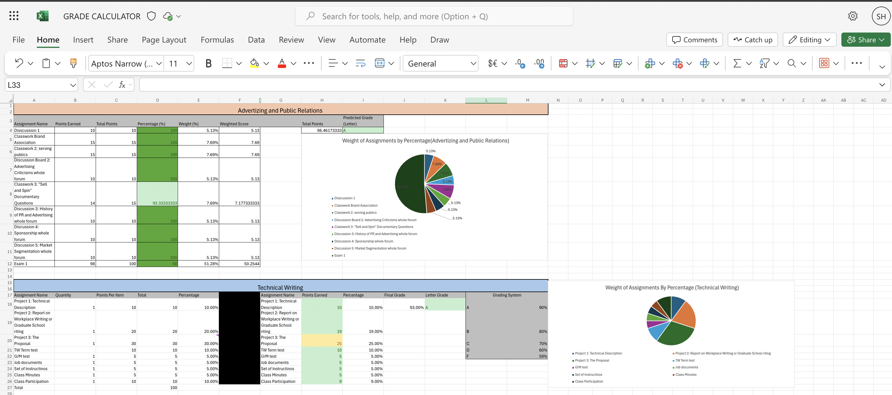
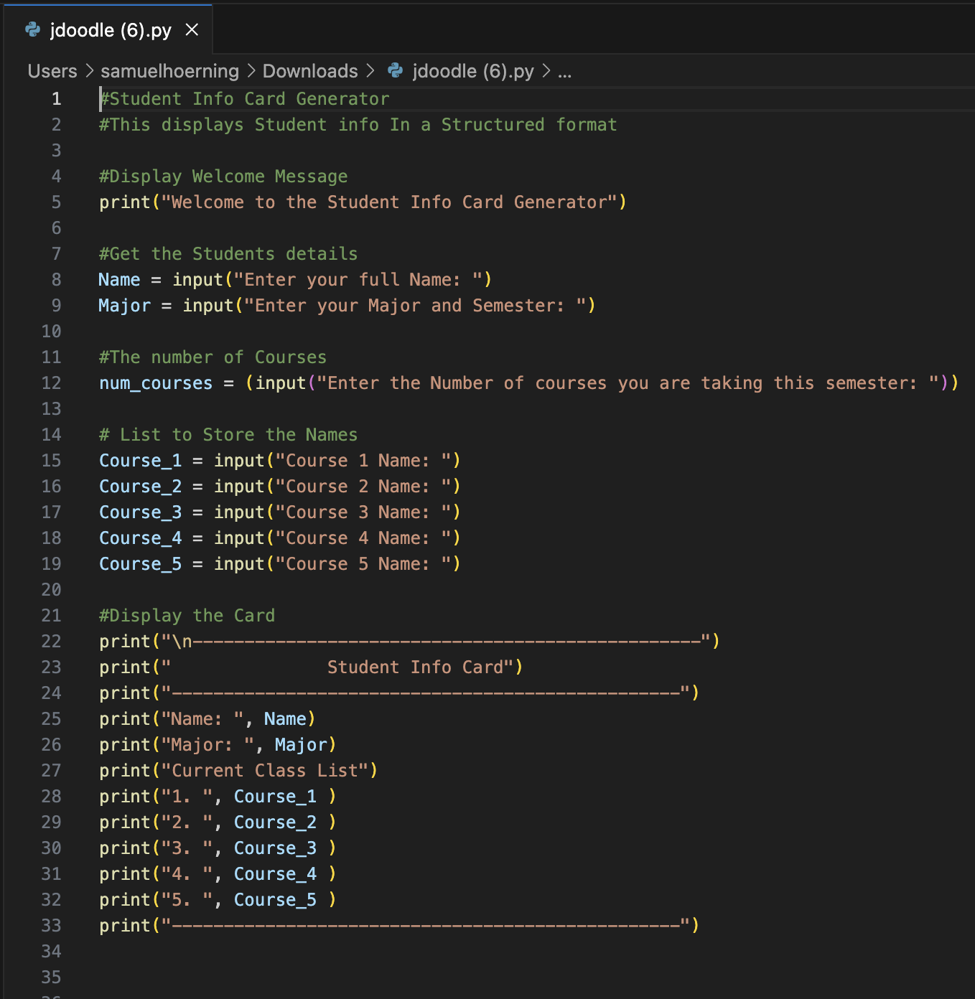
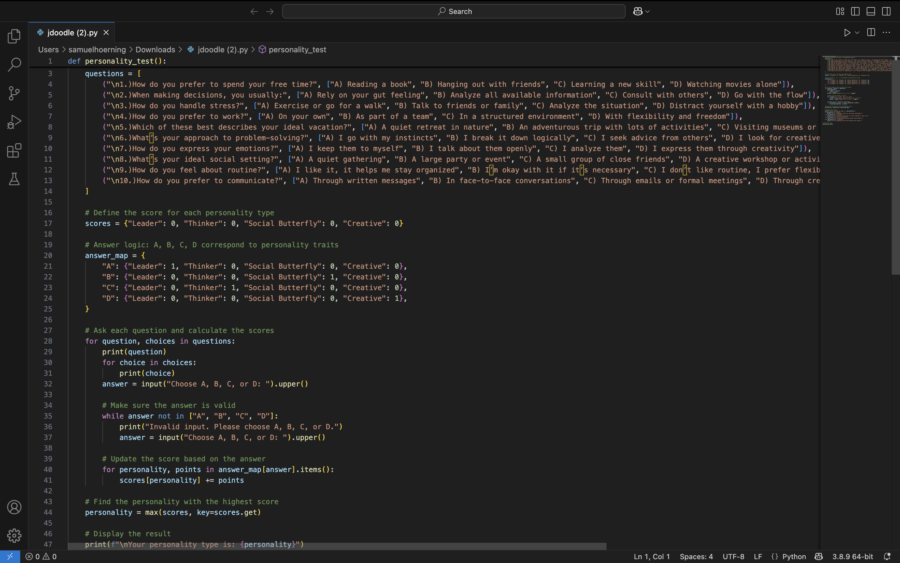

# Samuel Hoerning
Contact Info: slhoerning@loyola.edu

### About Me 
Hello! I am an experienced Sales Rep and Pharmaceutical professional with over 5 years of proven expertise in Pharmaceuticals and Weight Loss.

With skills in Microsoft 365, Data Analysis, Product Marketing, and Team Leadership, I am able to develop strategic sales plans, drive market penetration, and achieve consistent revenue growth across competitive territories. I am adept at using Salesforce CRM, Zendesk, and Excel for reporting and insights.

My dynamic skill set, commitment to customer-centric solutions, and passion for healthcare innovation position me as a valuable asset. In my spare time, I like to stay active with Rowing workouts and explore new culinary recipes.

You can find me on [LinkedIn](www.linkedin.com/in/samuel-hoerning-074481266) or samhoerning_ on Instagram.

### Education 
Loyola University Marlyand B.S.
Major: Biohealth with a concentration in Biomedical Commercialization
Minor: Management and Consulting
***
### Projects

#### Excel Grade Calculator
 **Project 1 Summary:**
 Created a Microsoft Excel grade calculator that automatically predicts course grades using weighted assignments and visual data charts to simplify academic performance tracking.

**Initial Project Idea:**
I came up with this project to simplify tracking grades across multiple courses. I set out to solve the problem of manually calculating final grades, which can be confusing and time-consuming, especially with weighted assignments.

**Tools I Used:**
I used Microsoft Excel to build the grade calculator, incorporating formulas, percentage calculations, and pie charts to visually represent assignment weights and scores.

**Challenges I Faced:**
One challenge was ensuring the accuracy of weighted scores and correctly linking assignment weights to the final grade prediction. I overcame this by double-checking formulas and testing the calculator with sample data.

**Other Resources:**
I used online Excel tutorials to refine chart designs and formula building. I did not collaborate directly with anyone but referenced sample grade book templates for inspiration.

**Result:**
I set out to create a user-friendly, automated grade tracker, and I achieved it. If I were to improve it, I would add conditional formatting to alert users when their grade drops below a certain threshold.
***
#### Python Automated Student Info Card 
 **Project 2 Summary:**
Developed a Python console application that collects and structures student information into a formatted “Student Info Card,” improving data organization and practicing basic input/output programming skills.

**Initial Project Idea:**
I came up with this project to create a simple "Student Info Card Generator." The goal was to quickly organize and display student information in a clean format, solving the problem of messy, unstructured data collection.

**Tools I Used:**
I used Python with basic functions like input() and print(). I also practiced using string formatting and simple user input methods to structure the output.

**Challenges I Faced:**
One challenge was handling a variable number of courses since the program currently expects exactly five courses regardless of how many the user inputs. I overcame initial input errors by clearly defining prompts and manually structuring the display output.

**Other Resources:**
I mainly relied on prior Python knowledge and basic syntax references. No external collaboration was used for this project.

**Result:**
I set out to create a basic, interactive console program that collects and displays student info — and successfully achieved it. In the future, I would improve flexibility by using loops and lists to handle any number of courses dynamically.

***
#### Python Automated Personality Test
**Project 3 Summary:**
 Built a Python-based interactive Personality Test that asks users questions, maps answers to traits, calculates scores, and reveals their personality type, while practicing input validation, loops, and dictionary handling.

**Initial Project Idea:**
I came up with this project to create an interactive Personality Test program. I wanted to solve the problem of static personality quizzes by making them dynamic and score-based, providing immediate feedback to users.

**Tools I Used:**
I used Python to build this project, applying conditional logic, dictionaries for scoring, loops for question handling, and user input validation to ensure the program runs smoothly.

**Challenges I Faced:**
One challenge was correctly mapping user answers to different personality traits and dynamically updating scores. I also had to make sure that invalid inputs were properly handled without crashing the program.

**Other Resources:**
I relied on Python documentation and online examples for structuring the quiz logic. No external collaboration was involved in creating this project.

**Result:**
I aimed to build a fun, accurate quiz that determines a user’s personality type based on their answers — and successfully did so. If I continued, I would expand it with more detailed questions and introduce tie-breaker logic if users score equally across traits.